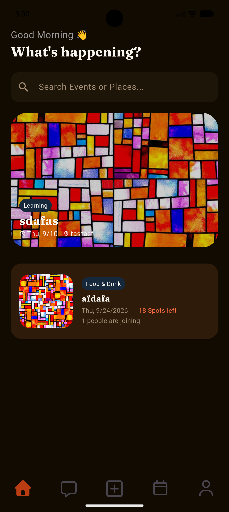
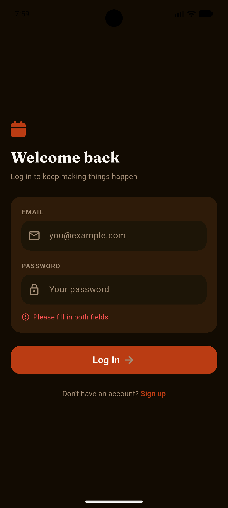
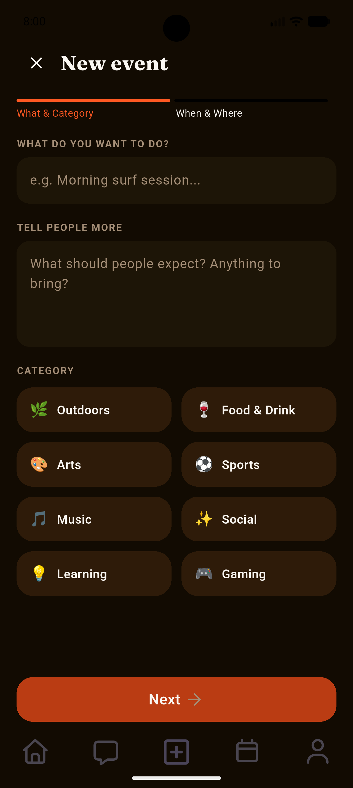
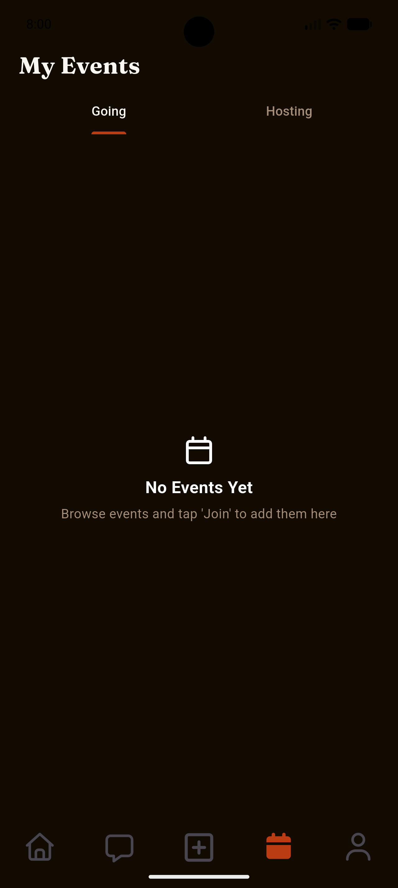

# Mach Mit

*[Deutsche Version weiter unten](#mach-mit-deutsch)*

A Flutter + Firebase mobile app for discovering and organizing local in-person events — built as a solo project to learn frontend development, with the Firebase backend built using some AI assistance.

## What it does

Mach Mit ("join in" in German) lets people browse events happening nearby, join ones they're interested in, and create their own. It's built for a German-speaking audience, with full support for both English and German legal/UI content.

- **Browse events** in a live, real-time feed
- **Create events** with a title, description, category, date/time, location, and photo
- **Join or leave** events, with live attendee counts and spots-left tracking
- **Track your events** across two views: events you're going to, and events you're hosting
- **Delete your own events**, with confirmation
- **Full account system**: email/password auth with email verification, profile editing, notification and privacy preferences that persist across sessions, and account deletion (with re-authentication)
- **Bilingual legal pages**: Privacy Policy, Terms of Service, and a German-law-compliant Impressum, in both English and German

## Tech stack

- **Frontend**: Flutter / Dart
- **Backend**: Firebase
  - Firebase Authentication (email/password, email verification)
  - Cloud Firestore (real-time event data, user settings)
  - Firebase Storage (event photos)
  - Firebase Hosting (legal document pages)
- **Key packages**: `image_picker`, `url_launcher`, `google_fonts`, `font_awesome_flutter`, `intl`

## Architecture notes

- A `StreamBuilder`-based `AuthGate` in `main.dart` drives navigation based on live Firebase auth state — no manual navigation logic needed for sign-in/sign-out flows.
- All Firestore/Storage operations are centralized in a single `EventService` class rather than scattered across widgets, keeping UI code focused on presentation.
- Firestore Security Rules enforce that users can only edit their own events or their own `joinedUserIds` entry — verified server-side, not just in the UI.

## What I learned building this

This was my first project connecting a Flutter frontend to a real backend rather than static/local data. Along the way I worked through:

- **Flutter/Dart fundamentals**: building a full multi-screen app from scratch — custom reusable widgets (`MyTextField`, `Post`, `MyHero`), a consistent design system driven by shared constants, custom fonts (Google Fonts), and layout work across `Row`/`Column`/`Stack`/`ListView` for a real, non-trivial UI
- **Debugging real Flutter errors**: layout exceptions (unbounded `Row` sizing), Gradle/Kotlin build errors, and stale-cache issues — reading stack traces and tracing them back to the actual widget or config causing them
- **The practical realities of shipping an app**: Android package naming, Gradle's `namespace` vs `applicationId`, code signing, and GDPR/German legal requirements (Impressum, Datenschutzerklärung)
- On the backend side, I came away understanding *why* the architecture is structured the way it is (a single `EventService`, security rules enforced server-side, live streams over one-time reads) even though the initial implementation was AI-assisted

## Screenshots







## Getting started

```bash
flutter pub get
flutterfire configure
flutter run
```

You'll need your own Firebase project with Authentication, Firestore, and Storage enabled, plus the security rules found in this repo applied via the Firebase Console.

---

<a name="mach-mit-deutsch"></a>
# Mach Mit (Deutsch)

*[English version above](#mach-mit)*

Eine Flutter- und Firebase-App, um lokale Events zu finden und zu organisieren — als Soloprojekt gebaut, um Frontend-Entwicklung zu lernen; das Firebase-Backend wurde mit etwas KI-Unterstützung gebaut.

## Was die App kann

Mach Mit lässt Nutzer Events in ihrer Nähe entdecken, beitreten oder selbst welche erstellen. Die App ist für ein deutschsprachiges Publikum gebaut, mit vollständiger Unterstützung für englische und deutsche rechtliche Inhalte und Oberflächentexte.

- **Events durchstöbern** in einem Live-Feed, der sich in Echtzeit aktualisiert
- **Events erstellen** mit Titel, Beschreibung, Kategorie, Datum/Uhrzeit, Ort und Foto
- **Events beitreten oder verlassen**, mit live aktualisierter Teilnehmerzahl und freien Plätzen
- **Eigene Events verfolgen** in zwei Ansichten: wo man mitmacht, und was man selbst organisiert
- **Eigene Events löschen**, mit Bestätigung
- **Vollständiges Kontosystem**: E-Mail/Passwort-Login mit E-Mail-Verifizierung, bearbeitbares Profil, Benachrichtigungs- und Datenschutzeinstellungen, die dauerhaft gespeichert werden, sowie Kontolöschung (mit erneuter Authentifizierung)
- **Zweisprachige rechtliche Seiten**: Datenschutzerklärung, Nutzungsbedingungen und ein rechtskonformes Impressum, auf Englisch und Deutsch

## Tech-Stack

- **Frontend**: Flutter / Dart
- **Backend**: Firebase
  - Firebase Authentication (E-Mail/Passwort, E-Mail-Verifizierung)
  - Cloud Firestore (Live-Eventdaten, Nutzereinstellungen)
  - Firebase Storage (Eventfotos)
  - Firebase Hosting (rechtliche Dokumentseiten)
- **Wichtige Pakete**: `image_picker`, `url_launcher`, `google_fonts`, `font_awesome_flutter`, `intl`

## Architekturhinweise

- Ein `StreamBuilder`-basiertes `AuthGate` in `main.dart` steuert die Navigation basierend auf dem live Firebase-Auth-Status — keine manuelle Navigationslogik für Login/Logout-Abläufe nötig.
- Alle Firestore-/Storage-Operationen sind in einer einzigen `EventService`-Klasse gebündelt, statt über einzelne Widgets verstreut zu sein — das hält den UI-Code auf Darstellung fokussiert.
- Firestore Security Rules stellen sicher, dass Nutzer nur ihre eigenen Events oder ihren eigenen Eintrag in `joinedUserIds` bearbeiten können — serverseitig durchgesetzt, nicht nur in der Oberfläche.

## Was ich dabei gelernt habe

Es war mein erstes Projekt, bei dem ich ein Flutter-Frontend mit einem echten Backend statt statischen/lokalen Daten verbunden habe. Dabei habe ich mich unter anderem mit Folgendem auseinandergesetzt:

- **Flutter/Dart-Grundlagen**: eine vollständige, mehrseitige App von Grund auf bauen — wiederverwendbare Widgets (`MyTextField`, `Post`, `MyHero`), ein einheitliches Designsystem basierend auf gemeinsamen Konstanten, eigene Schriftarten (Google Fonts), und Layout-Arbeit mit `Row`/`Column`/`Stack`/`ListView` für eine echte, nicht-triviale Oberfläche
- **Echte Flutter-Fehler debuggen**: Layout-Exceptions (unbegrenzte `Row`-Größe), Gradle-/Kotlin-Build-Fehler und Cache-Probleme — Stacktraces lesen und bis zum eigentlichen Widget oder der Konfiguration zurückverfolgen
- **Die praktischen Realitäten, eine App zu veröffentlichen**: Android-Package-Namen, der Unterschied zwischen Gradles `namespace` und `applicationId`, Code-Signing, und DSGVO-/deutsche Rechtsanforderungen (Impressum, Datenschutzerklärung)
- Auf der Backend-Seite habe ich verstanden, *warum* die Architektur so aufgebaut ist, wie sie ist (ein einzelner `EventService`, serverseitig durchgesetzte Security Rules, Live-Streams statt einmaliger Abfragen) — auch wenn die erste Umsetzung mit KI-Unterstützung entstanden ist

## Screenshots


## Loslegen

```bash
flutter pub get
flutterfire configure
flutter run
```

Du brauchst ein eigenes Firebase-Projekt mit aktivierter Authentication, Firestore und Storage, sowie die Security Rules aus diesem Repo, angewendet über die Firebase Console.
